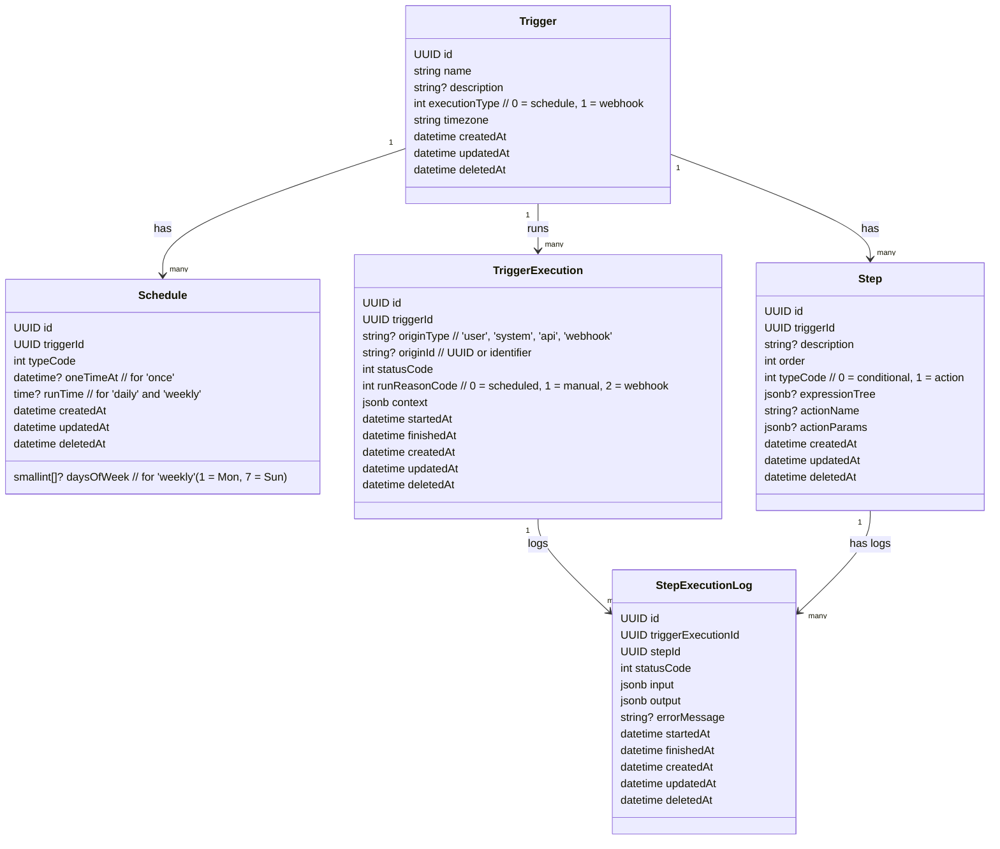

# 🤖 if-this-then-that-bot

A lightweight Laravel-based automation bot that checks external APIs, evaluates conditions, and performs actions such as sending emails or SMS messages.

Inspired by tools like Zapier, IFTTT, and n8n. Built with Laravel + Livewire, this MVP allows you to create your own scripted workflows powered by cron jobs and conditional logic.

---

## ✨ Features

- ⏰ Poll external APIs on a schedule (e.g., daily)
- 🔎 Evaluate logic conditions on JSON responses
- 💬 Trigger actions: send email, send SMS, or notify elsewhere
- 🧩 Modular: add new data sources, conditions, and outputs easily

---

## 📦 Tech Stack

- [Laravel 11+](https://laravel.com) – Framework
- [Livewire](https://livewire.laravel.com) – For future UI
- Laravel Scheduler – Polls data sources
- Laravel Queues – Handles outbound jobs
- Laravel Mail / Notification – Output methods
- Twilio (or any SMS API) – Mobile alerts

---

## 📸 Example Use Case

> **“If it's cloudy tomorrow, send me a reminder email to bring an umbrella.”**

1. Fetch weather from API
2. Check if `response.weather.cloudy === true`
3. Send email if true

---

## Class Diagram



## 🛠️ How to Use

### 1. Install dependencies

```bash
composer install
cp .env.example .env
php artisan key:generate
```